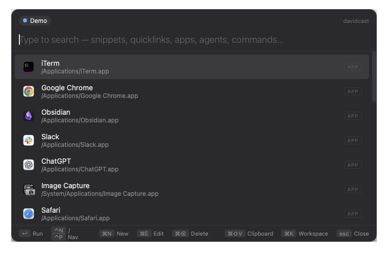
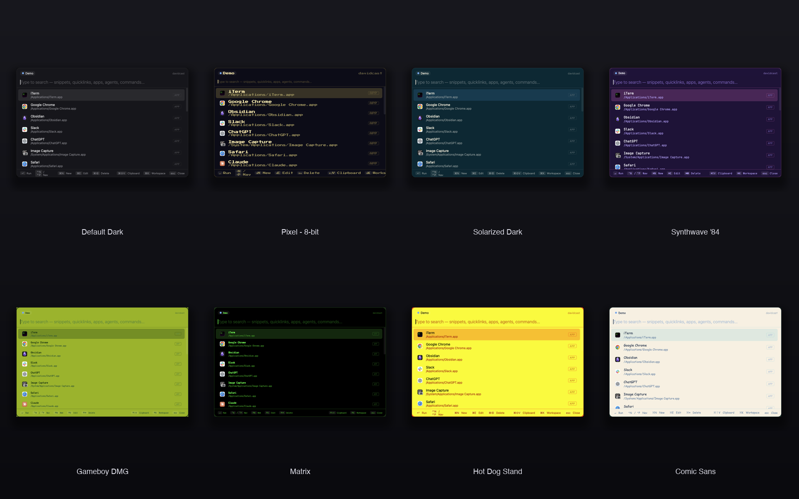

<p align="center">
  
</p>

<h1 align="center">davidcast</h1>

<p align="center">
  A keyboard-first launcher for macOS. Press <kbd>⌥ Space</kbd> anywhere, type, hit Enter.<br/>
  Snippets, quicklinks, apps, files, Claude CLI agents, Vite ports, Docker — all in one fuzzy pass.
</p>

<p align="center">
  
</p>

<p align="center">
  <a href="https://github.com/davidbroza/davidcast/releases/latest"></a>
  <a href="https://github.com/davidbroza/davidcast/actions/workflows/ci.yml"></a>
  <a href="https://codecov.io/gh/davidbroza/davidcast"></a>
  
  
  <a href="https://davidbroza.dev/projects/davidcast"></a>
</p>

> macOS-only (Ventura+). Personal project — built it for myself, and to learn Tauri 2.

## Install

```bash
brew install --cask davidbroza/tap/davidcast
```

Or grab the `.dmg` for your arch from [the latest release](https://github.com/davidbroza/davidcast/releases/latest), drag it into `/Applications`, and **right-click → Open** (the build is unsigned by Apple, so Gatekeeper asks once).

Future versions install themselves — the [auto-updater](#auto-update) shows an in-palette banner when a new release lands.

---

## Why

Raycast is great, but its data lives in an encrypted SQLite database you can't script, diff, version, or back up. davidcast keeps everything in human-readable JSON — `cat` your snippets, `git`-back them up, hand-edit them in any editor.

Also: I wanted to learn Tauri 2. This is the project I built to do it.

## What it does

| | |
|---|---|
| **Global palette** | `⌥ Space` anywhere. Single input, fuzzy search. Always focused. |
| **Snippets** | Text stored on disk, pasted at cursor (or just copied — Accessibility permission optional). `{placeholder}` args supported. |
| **Quicklinks** | URL templates with `{arg}` substitution. Open in default browser, Chrome, or Safari. |
| **App launcher** | Scans `/Applications`, `/System/Applications`, `~/Applications`. Native macOS icons, launch with a keyword. |
| **Running Claude CLI agents** | `ps` + `lsof` + ppid climb to find each terminal tab; `↵` jumps back to it. Shows the project's git branch and a dirty marker. |
| **Vite dev servers** | `lsof` joins listening ports against vite-shaped node processes; `↵` opens the URL in your default browser. |
| **Docker containers** | `docker ps` in JSON; two rows per container — `↵` opens a shell, type `logs` for `docker logs -f`. iTerm if installed, Terminal otherwise. |
| **File search** | `fd`-backed live search across configurable roots. Query syntax: `:png`, `:img`, `:newest`. Inline thumbnails for image files. |
| **Find Screenshots** | Side-preview pane on the right. `↵` copies the path, `⌘⇧C` copies the bitmap, `⌘R` reveals in Finder. Folders configurable in Preferences. |
| **Clipboard history** | Background watcher; `⌘⇧V` opens the history filter directly. |
| **Smart ranking** | Empty-query view sorts by recents (24-item localStorage cap) → kind priority → alphabetical. Typed queries get a `-0.4` prefix bonus and `-0.18` recents bonus on top of Fuse's score, so `i` lands on iTerm. |
| **Local analytics** | Append-only JSONL at `~/Library/Application Support/davidcast/analytics.jsonl` — `open`, `execute` (with kind, success, duration, query, result count), `no_results` (debounced). Local-only, never leaves the box. |
| **Window management** | `wm.left` / `right` / `top` / `bottom` / `maximize` / `center` move the frontmost (non-davidcast) window via osascript with the standard hide-then-act trick — Raycast halves without paying for Raycast. |
| **System quick actions** | Lock / Sleep / Empty Trash / Restart / Shut Down / Log Out — the macOS power menu, two keystrokes away. |
| **System stats** | CPU load, memory pressure, free disk, battery percentage and thermal state — a live status panel without opening Activity Monitor. |
| **Skills browser** | `skills.search` browses Claude Code SKILL.md files under `~/.claude/skills` (personal) and installed plugin caches. Side preview shows the markdown body; `↵` copies the path, `⌘⇧C` copies the full skill. |
| **Themes** | 20+ built-ins — Default, Pixel (8-bit), Solarized Dark/Light, Synthwave '84, Gameboy DMG, Matrix, Hot Dog Stand, Comic Sans, Dracula, Nord, Tokyo Night, Gruvbox, Cyberpunk, Brutalist, Bubblegum, Newsprint, Vaporwave… Live preview on hover. Drop your own JSON into `~/.../davidcast/themes/`. |
| **Sensitive snippets** | Snippets carry a `sensitive` flag — pink-glow rows, masked editor, body never renders in the palette subtitle so screen-sharing stays safe. |
| **Built-in commands** | "Create Snippet", "Create Quicklink", "Show X" filter chips for Vite / Docker / Agents / Clipboard, "Find Files", "Find Screenshots", "Preferences", "Switch Workspace" — all searchable like items. |
| **Workspaces** | Isolated namespaces. Personal / work / anything. Each has its own snippets and quicklinks on disk. |
| **Menu-bar only** | No dock icon. Tray menu for when you've forgotten the hotkey. |
| **Raycast import** | Paste the path of a Raycast JSON export in Preferences → Import. Handles `{argument name="x"}` → `{x}` and browser bundle IDs. |
| **In-app analytics view** | `show.analytics` rolls up the local JSONL into top queries, top items, kind breakdown, daily-opens sparkline, success rate, average dwell. Local-only. |
| **Auto-update** | Minisign-signed bundles published to GitHub Releases; the app polls `latest.json` on launch and offers an in-palette **Install & restart** banner when a newer version lands. |
| **Git backup** | Push the entire store to a git remote you control (Preferences → Backup). Uses the system `git` CLI so any auth that lets you `git push` from terminal Just Works. |

<p align="center">
  
</p>

## Build from source

### Dev

```bash
cd desktop
pnpm install
pnpm tauri dev
```

### Release app (signed for the auto-updater)

```bash
just install        # builds + drops davidcast.app into /Applications
# or, raw:
cd desktop && TAURI_SIGNING_PRIVATE_KEY="$(cat ~/.tauri/davidcast.key)" pnpm tauri build
```

Produces `src-tauri/target/release/bundle/macos/davidcast.app`. The signing key only matters if you're shipping artifacts other installs will auto-update from — see [§Auto-update](#auto-update) for the one-time keypair setup.

### First-run setup

To paste snippets at the cursor:

1. **System Settings → Privacy & Security → Accessibility**
2. Enable **davidcast**

Skipping this is fine — snippets still land on the clipboard, you just `⌘V` manually.

## Keybindings

**Palette**

| Key | Action |
|---|---|
| Type | Search everything (fuse.js fuzzy match on name, keyword, subtitle, URL, text, path) |
| `↵` | Run the selected item |
| `↑` / `↓` | Navigate |
| `⌃P` / `⌃N` | Navigate (emacs-style) |
| `⌃K` / `⌃J` | Navigate (vim-style) |
| `⌃U` | Clear the query |
| `⌃A` / `⌃E` | Jump query cursor to start / end |
| `⌘N` | New snippet / quicklink |
| `⌘E` | Edit the selected item |
| `⌘⌫` | Delete the selected item (two-press confirm) |
| `⌘K` | Switch workspace |
| `⌘,` | Open preferences |
| `⌘⇧V` | Open palette directly in clipboard history mode |
| `esc` | Close palette (or pop the active filter chip first) |

**File rows** (Find Files / Find Screenshots)

| Key | Action |
|---|---|
| `↵` | For images outside screenshot mode: copy bitmap. Otherwise: open. In screenshot mode: copy path. |
| `⌘↵` | Force-open in default app (even for images). |
| `⌘C` | Copy file path. |
| `⌘⇧C` | Copy image bitmap (when on an image row). |
| `⌘R` | Reveal in Finder. |

**Create / edit form**

| Key | Action |
|---|---|
| `↹` | Move through fields: name → value → (open-in) → keyword |
| `⌘↵` | Save |
| `esc` | Cancel |

## 30-second demo

**Quicklink:**

1. `⌥ Space` → type `create quicklink` → `↵`
2. Name `GitHub search`, URL `https://github.com/search?q={query}`, Keyword `ghs`
3. `⌘↵`
4. `⌥ Space` → `ghs` → `↵` → prompts for `query`, opens GitHub

**Snippet:**

1. Copy any text (from anywhere)
2. `⌥ Space` → type `create snippet` → `↵` — the value field is already pre-filled from your clipboard
3. Name it, `⌘↵`
4. Next time: `⌥ Space` → name → `↵` → "✓ Copied to clipboard" toast, then it pastes

**App:**

1. `⌥ Space` → `iterm` → `↵` — launches iTerm

**Vite dev server:**

1. `pnpm dev` in any project (Vite picks a port, e.g. 5173)
2. `⌥ Space` → type the project name → `↵` opens `http://localhost:5173`

**Docker container:**

1. `⌥ Space` → `docker` → `↵` on "Show Docker Containers" — filters to just containers
2. Find your container, `↵` shells in. Or type `logs` to find the matching `… · logs` row and tail.

**Find a screenshot fast:**

1. `⌥ Space` → `screenshots` → `↵` on "Find Screenshots"
2. Arrow through; the right-side preview updates live
3. `↵` copies the path (paste-ready). `⌘⇧C` if you want the bitmap.

## Releases

Tagging `vX.Y.Z` on `main` triggers `.github/workflows/release.yml` — it builds both Apple Silicon and Intel bundles, generates notes from `git log <prev_tag>..HEAD`, signs each `.app.tar.gz` with the auto-updater key, and publishes a GitHub Release with `.app.tar.gz` + `.app.tar.gz.sig` + `.dmg` + `latest.json` artifacts. CI (`cargo check`/`test` + `pnpm build`) runs on every push and PR; green main is the prerequisite for tagging.

## Auto-update

Installed copies of davidcast poll `https://github.com/davidbroza/davidcast/releases/latest/download/latest.json` on launch. When a newer version is available the palette shows an "Install & restart" banner — one click downloads the signed tarball, verifies the minisign signature against the public key baked into the binary, swaps `/Applications/davidcast.app`, and relaunches. The check is gated by **Preferences → Check for updates on launch** (default on); manual checks run via the `app.check_updates` built-in command.

### One-time signing-key setup (maintainers only)

Updates are signed with a minisign keypair. The public key lives in `desktop/src-tauri/tauri.conf.json::plugins.updater.pubkey`. The private key must be set as a GitHub Actions secret on this repo:

```bash
# Generate the keypair (passwordless — easier for CI):
pnpm --dir desktop tauri signer generate --ci -p '' -w ~/.tauri/davidcast.key -f

# Replace the pubkey field in tauri.conf.json with the contents of:
cat ~/.tauri/davidcast.key.pub

# Upload the private key as a GH Actions secret:
gh secret set TAURI_SIGNING_PRIVATE_KEY < ~/.tauri/davidcast.key
```

Lose the private key and you can't ship updates to existing installs (the public key won't verify a key generated by anyone else). Keep `~/.tauri/davidcast.key` in 1Password / a password manager.

### One-time Homebrew cask auto-bump setup

After each release publishes, `.github/workflows/bump-cask.yml` rewrites the formula in [`davidbroza/homebrew-tap`](https://github.com/davidbroza/homebrew-tap) so `brew install` always points at the latest tag. It needs a fine-grained PAT with Contents:write on the tap repo:

1. https://github.com/settings/personal-access-tokens/new → resource owner `davidbroza`, repository `davidbroza/homebrew-tap`, permission `Contents: Read and write`.
2. `gh secret set TAP_GITHUB_TOKEN --repo davidbroza/davidcast` (paste the PAT).

Without this secret the workflow fails loudly on the next release; the release itself still ships, only the cask bump step skips.

## Architecture

```
┌────────────────────────────────────────────┐
│ macOS desktop app (Tauri v2, Rust + React) │
│   ├── palette window   (borderless, blur)  │
│   ├── preferences window                   │
│   └── menu-bar tray                        │
│             │                              │
│             ▼                              │
│   Rust core                                │
│     ├── JSON store (atomic writes)         │
│     ├── global hotkey  (⌥ Space)           │
│     ├── app scanner                        │
│     ├── clipboard / osascript paste        │
│     └── Raycast import                     │
└─────────────────┬──────────────────────────┘
                  ▼
  ~/Library/Application Support/davidcast/
    config.json                  # workspaces + active
    workspaces/<id>/
      snippets.json
      quicklinks.json
    analytics.jsonl              # local-only event log
    themes/                      # user-dropped themes
    .backup-git/                 # git backup repo (only if you wired one up)
```

Every item has a UUIDv7 id, `created_at` / `updated_at`, a `deleted` tombstone, and a monotonic `rev` — clean enough on disk that anything could read or write the store from outside the app.

## Storage layout

Everything davidcast persists is a plain JSON (or JSONL) file under `~/Library/Application Support/davidcast/`. You can `cat`, `diff`, version, sync, and hand-edit any of it. The on-disk shape:

```
~/Library/Application Support/davidcast/
  config.json                  # workspaces + active id + per-plugin toggles
  workspaces/
    <workspace-id>/
      snippets.json            # array of Snippet
      quicklinks.json          # array of Quicklink
  themes/
    *.json                     # any extra themes you drop in (built-ins are baked in)
  analytics.jsonl              # append-only event log, one JSON per line
  apps_cache.json              # transient: scanned /Applications results
  icons/                       # transient: extracted .icns → .png cache
  .backup-git/                 # only present if you've wired up a git backup remote
```

**Workspace membership is implicit in the path.** Snippets and quicklinks don't carry a `workspace` field — moving an item between workspaces is a file move. Atomic writes (write-temp-then-rename) are used everywhere, so a kill `-9` mid-save can't corrupt the store. Deletes are tombstones (`deleted: true`), never `rm`.

### `config.json`

```jsonc
{
  "active": "ws-personal-uuid",
  "workspaces": [
    { "id": "ws-personal-uuid", "name": "personal", "color": "#7BD88F", "created_at": "..." }
  ],
  "show_vite_inline": true,
  "show_docker_inline": true,
  "show_snippets_inline": true,
  "show_quicklinks_inline": true,
  "screenshot_dirs": ["~/Desktop", "~/Pictures/Screenshots"],
  "theme": "default"
}
```

### `workspaces/<id>/snippets.json`

```jsonc
[
  {
    "id": "01941d…",                       // UUIDv7 — sortable by creation
    "name": "Email signature",
    "keyword": "sig",                      // optional shortcut for fuzzy search
    "text": "Best,\nDavid",
    "created_at": "2026-04-26T09:00:00Z",  // RFC3339 UTC
    "updated_at": "2026-04-26T09:00:00Z",
    "deleted": false,                      // tombstone
    "rev": 1                               // monotonic, bumps on every write
  }
]
```

### `workspaces/<id>/quicklinks.json`

```jsonc
[
  {
    "id": "01941d…",
    "name": "Tailwind Docs",
    "keyword": "tw",
    "url": "https://tailwindcss.com/docs?q={q}",  // {placeholder} prompts at run time
    "open_in": "default",                          // "default" | "chrome" | "safari"
    "created_at": "...",
    "updated_at": "...",
    "deleted": false,
    "rev": 1
  }
]
```

### `analytics.jsonl`

One event per line, append-only, never reordered. Three event kinds today:

```jsonc
{"ts": 1777161600000, "session_id": "<uuid>", "kind": "open",       "data": {"via": "hotkey"}}
{"ts": 1777161600500, "session_id": "<uuid>", "kind": "execute",    "data": {"kind": "App", "name": "iTerm", "outcome": "execute", "success": true, "duration_ms": 12, "q": "i", "result_count": 41, "dwell_ms": 740, "kind_filter": null}}
{"ts": 1777161601200, "session_id": "<uuid>", "kind": "no_results", "data": {"q": "zzz", "dwell_ms": 920, "kind_filter": null}}
```

`kind` is the event class; `data` is a free-form payload owned by the producer. The `show.analytics` command reads the whole file and renders top queries / items / kind breakdown / daily-opens sparkline / success rate / average dwell. **Local-only** — there is no upload code path. `analytics_clear` deletes the file. The aggregation logic is unit-tested in `desktop/src-tauri/src/analytics.rs`.

### Backup to git

Optional. Pushes the entire store directory to a git remote you control — `Preferences → Backup (Git)` to wire it up. davidcast doesn't store credentials; whatever lets you `git push` from terminal (SSH key, gh CLI, credential helper) is what it uses.

```
Preferences → Backup (Git)
  ☑ Enable git backup
  Remote: git@github.com:you/davidcast-backup.git
  Branch: main
  ☐ Include analytics.jsonl   ← off by default for privacy
  [Connect]    ← initial push (only works against an empty remote)
  [Sync now] [Pull] [Force push]
```

Working tree = the data dir; the `.git` is tucked away at `~/Library/Application Support/davidcast/.backup-git/`. A 60-second background timer pushes if (a) backup is enabled, (b) the repo is dirty, and (c) more than 10 minutes have passed since the last successful push — tunable via `auto_interval_min` in `config.json`.

**Conflicts.** The happy path is `pull --rebase` then push. If your remote has commits the app doesn't know about (e.g. another machine pushed first), sync errors out with "use Force Push or resolve manually" — by design, davidcast never auto-merges across machines. Open the .git dir in a terminal and use `git` directly, or click **Force push** to overwrite the remote with the local store. Force push uses `--force-with-lease`, so a concurrent push from another machine still safely blocks it.

### Themes

20+ themes ship built in. Pick `themes.switch` in the palette and arrow through them — every row **live-previews on hover**, so you can scrub the look without committing.

<p align="center">
  
</p>

| Theme | Vibe |
|---|---|
| **Default Dark** | Soft slate background, blue accents, system-font sans-serif. The quiet one most people stop on. |
| **Pixel — 8-bit** | Press Start 2P everywhere, chunky pixel rows, warm CRT yellow. Reads like a NES menu — keyboard hints render in 8-bit too. |
| **Solarized Dark / Light** | Ethan Schoonover's classic palette, exact base16 hex values. The one your terminal already runs. |
| **Synthwave '84** | Magenta-on-purple with neon glow on the focused row. Pairs well with `dark sun` wallpaper and zero deadlines. |
| **Gameboy DMG** | Pea-green LCD, four shades, "Early GameBoy" bitmap font. Type `iter` and squint. |
| **Matrix** | Pure black, three shades of `#00FF41`, monospace stack. Looks like the screensaver, works like a launcher. |
| **Hot Dog Stand** | Windows 3.1's worst color scheme, faithfully ported. Yellow background, red title bar. Use to repel coworkers. |
| **Comic Sans (please don't)** | Comic Sans MS at every size. The theme registry has no taste, and that is fine. |
| _and more…_ | Dracula, Nord, Tokyo Night, Gruvbox, Cyberpunk, Brutalist, Bubblegum, Newsprint, Vaporwave, Hacker (Green on Black), Retro Amber CRT, Nerd (JetBrains Mono), High Contrast, Light. |

Themes are full visual identities — colour tokens, font family, corner radius, badge pills and keyboard-hint typography all wired through CSS custom properties on the document root.

#### Custom themes

Drop a JSON file into `~/Library/Application Support/davidcast/themes/`. It shows up in `themes.switch` on next launch — same shape as the built-ins:

```jsonc
{
  "id": "midnight",
  "name": "Midnight",
  "tokens": {
    "bg": "#0F0E2E",
    "bg-solid": "#0F0E2E",
    "fg": "#E8E8EA",
    "fg-dim": "#9A98C8",
    "border": "#2A2848",
    "accent": "#818CF8",
    "font-family": "'JetBrains Mono', monospace",
    "font-family-mono": "'JetBrains Mono', monospace"
    /* …any token name from the built-ins in desktop/src-tauri/src/themes.rs… */
  }
}
```

Each token becomes a CSS custom property at the document root (`--bg`, `--fg`, etc.). See `desktop/src/palette.css` for the full list of vars the UI consumes.

`themes.switch` lists everything (built-ins + your folder), and the choice is persisted as `config.theme` in `config.json`.

## Repo layout

```
davidcast/
├── desktop/              # the Tauri app
│   ├── src/              # React + TypeScript frontend
│   │   ├── components/   # Palette, ItemForm, Preferences, Analytics, Help, ...
│   │   ├── App.tsx       # palette root + view state
│   │   └── api.ts        # Tauri invoke wrappers
│   ├── src-tauri/        # Rust backend
│   │   └── src/
│   │       ├── lib.rs        # tray, window events, plugin setup, background timers
│   │       ├── store.rs      # atomic JSON persistence
│   │       ├── types.rs      # Snippet, Quicklink, Workspace, Config
│   │       ├── apps.rs       # macOS app scanner
│   │       ├── hotkey.rs     # global shortcut
│   │       ├── analytics.rs  # local JSONL log + aggregation
│   │       ├── backup.rs     # git CLI wrapper for store backup
│   │       └── commands.rs   # Tauri command handlers
│   └── branding/         # icon + tray template SVGs
├── marketing/            # Remotion promo video sources
├── docs/assets/          # README screenshots + GIF
└── .github/workflows/    # ci.yml, release.yml, bump-cask.yml
```

## Dev requirements

- macOS Ventura or newer
- Node 20+ with pnpm
- Rust stable
